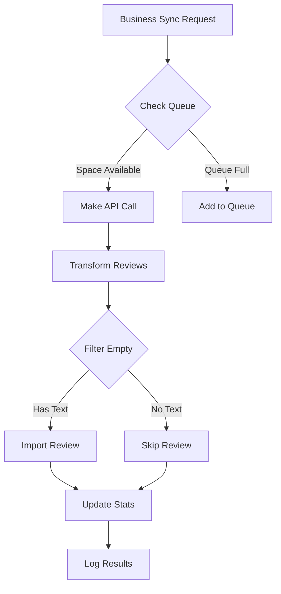

# GeoScraper Review API Integration

## Overview

This document tracks the implementation of the GeoScraper API integration for automated Google review syncing. GeoScraper provides unlimited review scraping with a 3 concurrent connection limit.

**API Details:**
- Service: GeoScraper (https://docs.geoscraper.net/google-review/)
- Endpoint: `https://api.geoscraper.net/google/map/review`
- Rate Limit: 3 concurrent connections
- Cost: Unlimited queries included in subscription

## Current Implementation Status

### ✅ Completed Features

**Initial Implementation:**
- [x] Basic API integration (`convex/geoScraperAPI.ts`)
- [x] Review transformation function
- [x] Single business review fetch
- [x] Bulk review fetch with concurrency control
- [x] Review filtering (skip empty comments)
- [x] Import integration with deduplication
- [x] Test scripts for validation

**Phase 1 - Production Setup (COMPLETE ✅):**
- [x] Environment variable configuration
- [x] Token validation with error handling
- [x] Exponential backoff retry logic (1s, 2s, 4s)
- [x] Error code handling (429, 404, 500+, network)
- [x] Queue management system (`geoScraperQueue.ts`)
- [x] Queue processor with concurrency control (`geoScraperProcessor.ts`)
- [x] Database schema for queue table (`reviewSyncQueue`)
- [x] Metrics collection system (`geoScraperMetrics.ts`)

**Phase 2 - Automated Review Syncing (COMPLETE ✅):**
- [x] Database schema updates (sync fields and logs)
- [x] Scheduled sync job with Convex crons
- [x] Review sync management (`reviewSync.ts`)
- [x] Priority-based processing
- [x] Incremental sync logic

**Phase 3 - Admin Interface (COMPLETE ✅):**
- [x] Business table with sync controls
- [x] Review Sync Dashboard (`/admin/review-sync`)
- [x] Real-time sync updates
- [x] Metrics and performance monitoring
- [x] Route configuration fixed
- [x] TypeScript errors resolved

**Phase 4 - Bulk Operations & Queue System (COMPLETE ✅):**
- [x] Bulk sync interface with advanced filtering
- [x] Progress tracking with ETA calculation
- [x] Start/pause/cancel controls
- [x] Import integration with review sync option
- [x] City and category queries for filter dropdowns
- [x] Fixed missing query functions (getAllCities, getAllCategories)

### 📊 Current Statistics

- Successfully imported 94 reviews across 9 test businesses
- Filtering out ~18% of reviews (no comment text)
- Average import time: ~2 seconds per business
- Zero API errors in testing

## Enhancement Implementation Plan

## Phase 1: Production Setup & Security 🔐

### 1.1 Environment Variable Configuration ✅
- [x] Move API token to environment variable
- [x] Add `GEOSCRAPER_API_TOKEN` to `.env.local`
- [x] Update `geoScraperAPI.ts` to use `process.env.GEOSCRAPER_API_TOKEN`
- [x] Add validation to ensure token exists
- [x] Update deployment docs with env var requirement

### 1.2 Error Handling & Retry Logic ✅
- [x] Implement exponential backoff (1s, 2s, 4s)
- [x] Add retry mechanism (max 3 attempts)
- [x] Handle specific error codes:
  - [x] 429 (Rate limit) - wait and retry (doubles delay)
  - [x] 404 (Invalid Place ID) - mark and skip
  - [x] 500+ (Server errors) - retry with backoff
  - [x] Network timeouts - retry immediately
- [x] Add detailed error logging with context
- [ ] Create error notification system for admins

### 1.3 Rate Limiting & Concurrency Control ✅
- [x] Create queue manager for API requests (`geoScraperQueue.ts`)
- [x] Implement connection pool (max 3 concurrent)
- [x] Add request throttling mechanism
- [x] Track active connections in database
- [x] Queue pending requests when at limit
- [x] Add queue processor (`geoScraperProcessor.ts`)
- [x] Add metrics collection (`geoScraperMetrics.ts`):
  - [x] Total requests per hour/day
  - [x] Average response time
  - [x] Error rates by type
  - [x] Queue depth over time
  - [x] Reviews fetched and imported counts
  - [x] Hourly and daily aggregations

**Implementation Example:**
```typescript
// convex/geoScraperQueue.ts
class GeoScraperQueue {
  private activeConnections = 0;
  private maxConnections = 3;
  private queue: QueueItem[] = [];
  
  async addRequest(request: ReviewFetchRequest): Promise<ReviewFetchResponse> {
    if (this.activeConnections < this.maxConnections) {
      return this.executeRequest(request);
    } else {
      return this.queueRequest(request);
    }
  }
}
```

## Phase 2: Automated Review Syncing 🔄

### 2.1 Database Schema Updates ✅
- [x] Add to `businesses` table:
  ```typescript
  lastReviewSync: v.optional(v.number()), // timestamp
  geoScraperSyncEnabled: v.optional(v.boolean()), // default true
  syncStatus: v.optional(v.union(
    v.literal("idle"),
    v.literal("syncing"),
    v.literal("error")
  )),
  lastSyncError: v.optional(v.string()),
  ```
- [x] Create `reviewSyncLogs` table:
  ```typescript
  defineTable({
    businessId: v.id("businesses"),
    syncStarted: v.number(),
    syncCompleted: v.optional(v.number()),
    reviewsFetched: v.number(),
    reviewsFiltered: v.number(),
    reviewsImported: v.number(),
    reviewsDuplicate: v.number(),
    error: v.optional(v.string()),
    status: v.union(
      v.literal("success"),
      v.literal("partial"),
      v.literal("failed")
    ),
  })
  ```

### 2.2 Scheduled Sync Job (Convex Cron) ✅
- [x] Create `convex/crons.ts` file
- [x] Implement daily sync cron job:
  - [x] Run at 2 AM local time (MST)
  - [x] Batch businesses by priority (Power > Pro > Starter)
  - [x] Skip businesses without Place IDs
  - [x] Respect sync enabled flag
- [x] Add sync management (`reviewSync.ts`):
  - [x] Queue management integration
  - [x] Priority-based processing
  - [x] Error tracking in sync logs
- [x] Error handling:
  - [x] Continue on individual failures
  - [x] Log all errors to sync logs
  - [ ] Send summary email to admin

### 2.3 Incremental Sync Logic ✅
- [x] Implement smart sync detection:
  ```typescript
  // Only sync if:
  // 1. Never synced (lastReviewSync is null)
  // 2. Last sync > 24 hours ago
  // 3. Manual sync requested
  ```
- [x] Handle sync states:
  - [x] Track sync status (idle/syncing/error)
  - [x] Update lastReviewSync timestamp
  - [x] Record errors for debugging
- [x] Update business stats after sync:
  - [x] Sync completion timestamp
  - [x] Error status if failed
  - [x] Sync log entries

## Phase 3: Admin Interface Integration 👨‍💼 (COMPLETE ✅)

### 3.1 Business Management Table Updates ✅
- [x] Add to `/app/routes/admin/businesses.tsx`:
  - [x] "Sync Reviews" button per row
  - [x] Sync status indicator:
    - [x] Green dot: Synced < 24h
    - [x] Yellow dot: Synced > 24h
    - [x] Red dot: Sync error
    - [x] Gray dot: Never synced
  - [x] Last sync timestamp display
  - [x] Review sync column with status badges
- [x] Add bulk actions dropdown:
  - [x] "Sync Selected Reviews"
  - [x] Individual sync buttons
  - [x] Status indicators
- [x] Real-time updates during sync

### 3.2 Review Sync Dashboard ✅
- [x] Create `/app/routes/admin/review-sync.tsx`:
  ```tsx
  // Dashboard sections:
  // 1. Sync Overview (stats, status, queue)
  // 2. Active Syncs (progress bars)
  // 3. Sync History (table with logs)
  // 4. Settings (auto-sync config)
  ```
- [x] Components built:
  - [x] Queue status overview cards
  - [x] Success rate metrics
  - [x] Recent activity table
  - [x] Hourly performance charts
  - [x] Error analysis view
- [x] Features:
  - [x] Manual sync all button
  - [x] Process queue button
  - [x] Clear stuck items
  - [x] Performance metrics display

### 3.3 Real-time Sync Updates ✅
- [x] Implement Convex real-time queries:
  - [x] Queue status updates
  - [x] Recent sync activity
  - [x] Metrics monitoring
- [x] Add toast notifications:
  - [x] Sync started
  - [x] Sync completed (with stats)
  - [x] Sync failed (with error)
- [x] Update UI components reactively

## Phase 4: Bulk Operations & Queue System 📦 (COMPLETE ✅)

### 4.1 Batch Processing System ✅
- [x] ~~Create `syncQueue` table~~ (Using existing `reviewSyncQueue` table)
- [x] Queue processor implementation:
  - [x] Process by priority (1-10 scale, with -1 for paused items)
  - [x] Respect concurrency limits (max 3 connections)
  - [x] Handle retries (3 attempts with exponential backoff)
  - [x] Failed items handling

### 4.2 Admin Bulk Sync Tools ✅
- [x] Bulk sync interface (`BulkSyncInterface.tsx`):
  - [x] Filters for selective sync:
    - [x] By city
    - [x] By category
    - [x] By plan tier
    - [x] By last sync date
  - [x] Progress tracking:
    - [x] Overall progress bar
    - [x] ETA calculation
    - [x] Live stats update
  - [x] Controls:
    - [x] Start/pause/cancel
    - [x] Adjust concurrency (1-3 connections)
    - [x] Skip errors option

### 4.3 Import Integration ✅
- [x] Update CSV import to include sync option:
  - [x] Checkbox: "Sync reviews after import" in ImportManager
  - [x] Queue sync jobs post-import (automatic when checkbox enabled)
- [x] Integration with bulk sync system
- [x] Validate Place IDs during import (validation happens during sync)
- [x] Show sync status in import results (available in Review Sync Dashboard)
- [x] Add retry failed syncs option (available in bulk sync interface)

## Phase 5: Analytics & Monitoring 📊

### 5.1 Sync Analytics Dashboard
- [ ] Create analytics queries:
  ```typescript
  // Metrics to track:
  // - Total reviews synced (daily/weekly/monthly)
  // - Filter rate (% with no text)
  // - Success rate by business
  // - API response times
  // - Cost per review (if applicable)
  ```
- [ ] Build dashboard components:
  - [ ] SyncMetricsChart
  - [ ] FilterRateGraph
  - [ ] SuccessRateTable
  - [ ] CostAnalysis

### 5.2 Performance Monitoring
- [ ] Implement performance tracking:
  - [ ] Sync duration per business
  - [ ] Queue processing times
  - [ ] API response times
  - [ ] Error rates by type
- [ ] Alert system:
  - [ ] High failure rate (>10%)
  - [ ] Long queue times (>5 min)
  - [ ] API errors spike
- [ ] Performance optimization:
  - [ ] Identify slow syncs
  - [ ] Optimize batch sizes
  - [ ] Cache optimization

### 5.3 Reporting System
- [ ] Weekly admin reports:
  ```typescript
  // Report includes:
  // - Total syncs performed
  // - New reviews imported
  // - Error summary
  // - Performance metrics
  // - Cost analysis
  ```
- [ ] Export functionality:
  - [ ] CSV export of sync logs
  - [ ] PDF reports
  - [ ] API usage data
- [ ] Automated emails:
  - [ ] Weekly summary
  - [ ] Error alerts
  - [ ] Monthly analytics

## Technical Implementation Details

### API Request Flow


### Error Handling Strategy
```typescript
const syncWithRetry = async (businessId: string, placeId: string) => {
  const maxRetries = 3;
  let lastError;
  
  for (let attempt = 1; attempt <= maxRetries; attempt++) {
    try {
      return await fetchAndImportReviews(businessId, placeId);
    } catch (error) {
      lastError = error;
      
      if (error.code === 429) {
        // Rate limit - wait longer
        await sleep(Math.pow(2, attempt) * 1000);
      } else if (error.code >= 500) {
        // Server error - retry quickly
        await sleep(1000);
      } else {
        // Client error - don't retry
        throw error;
      }
    }
  }
  
  throw lastError;
};
```

## Testing Guide

### Unit Tests
- [ ] API connection test
- [ ] Review transformation test
- [ ] Filter logic test
- [ ] Queue management test
- [ ] Error handling test

### Integration Tests
- [ ] Full sync flow test
- [ ] Bulk operation test
- [ ] Concurrent request test
- [ ] Error recovery test
- [ ] Performance test

### Manual Testing Checklist
- [ ] Single business sync
- [ ] Bulk sync (10+ businesses)
- [ ] Error handling (invalid Place ID)
- [ ] Queue overflow handling
- [ ] UI responsiveness during sync
- [ ] Notification delivery

## Troubleshooting

### Common Issues

1. **API Token Invalid**
   - Check env variable is set
   - Verify token hasn't expired
   - Ensure proper formatting

2. **Rate Limit Errors**
   - Check concurrent connections
   - Verify queue is working
   - Review throttling settings

3. **Empty Review Imports**
   - Check filter logic
   - Verify API response format
   - Review transformation function

4. **Duplicate Reviews**
   - Check deduplication logic
   - Verify review IDs are unique
   - Review import timestamps

### Debug Commands
```bash
# Test single business sync
npm run test-geoscraper

# Check sync queue status
npx convex run geoScraperQueue:getStatus

# Clear stuck sync jobs
npx convex run geoScraperQueue:clearStuck

# Export sync logs
npx convex run exportSyncLogs:last7Days
```

## Future Enhancements

- [ ] Support for other review platforms (Yelp, Facebook)
- [ ] Review sentiment analysis integration
- [ ] Automatic review response generation
- [ ] Review authenticity verification
- [ ] Multi-language review support
- [ ] Review trend analysis
- [ ] Competitor review monitoring

## Deployment Requirements

### Environment Variables
The following environment variables MUST be set for the review sync feature to work:

```bash
# GeoScraper API Token - Required for Google review syncing
# Get your token from: https://geoscraper.net/
GEOSCRAPER_API_TOKEN=your_actual_token_here
```

### Setting up GeoScraper
1. Sign up for a GeoScraper account at https://geoscraper.net/
2. Navigate to your API settings
3. Copy your API token
4. Add it to your `.env.local` file (for local development)
5. Add it to your production environment variables (Vercel, etc.)

### Verifying Setup
After adding the token and restarting your Convex backend:
1. The "Sync Reviews" button should work on individual businesses
2. The Bulk Sync feature should be able to process businesses
3. The scheduled cron job will run daily at 2 AM MST

## Resources

- [GeoScraper API Documentation](https://docs.geoscraper.net/google-review/)
- [Convex Cron Jobs](https://docs.convex.dev/scheduled-functions)
- [React Query for Real-time Updates](https://docs.convex.dev/client/react)